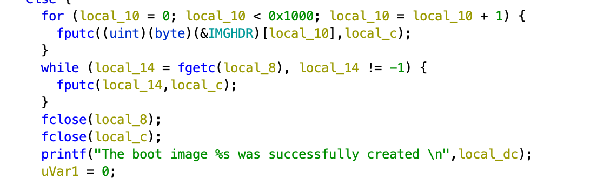

How netboot works
=================

**09.** You need some 3com/lanworks magic to work with
------------------------------------------------------

Before you are able to boot using TriROM/Bootware ROM,
you need to add some magic sauce.
Looks like lanworks released tool named imggen, where this souce lives.

Also, there is mknbi tool still around with I didn't try.
(And I didn't know that this tool exists while researching).

**10.** Reverse engineering
---------------------------

`imggen`, is old ELF32 binary.
I found this binary somewhere on mailing list and I think that no one should try to run it
nowadays.

Then ghydra can be your friend.

As you can see, all magic sauce is hidden in first loop.

This loop just copies 4096 bytes from somewhere in binary.

`extract.sh` contains dd command which extracts DOS COM file (you can even try it to run it from DOSBOX - notting happens).

**20.** Putting all together
----------------------------

You just need to put this header file in front of your kernel.

`cat header bzImage > bootable`

But this will not work with newest kernels, because they need boot protocol established.

But! This works flawlessly with diskette images, so you can boot MS-DOS!

https://youtu.be/p_cQGkIcOR8

It seems good. Would be nice to use ipxe for chainloading?

**30.** Why not to use iPXE?
----------------------------

iPXE seems to be broken on i486 for now (2021).

https://twitter.com/ipxe/status/1394038660484509699

Boot just hangs somewhere in hign memory allocator.
